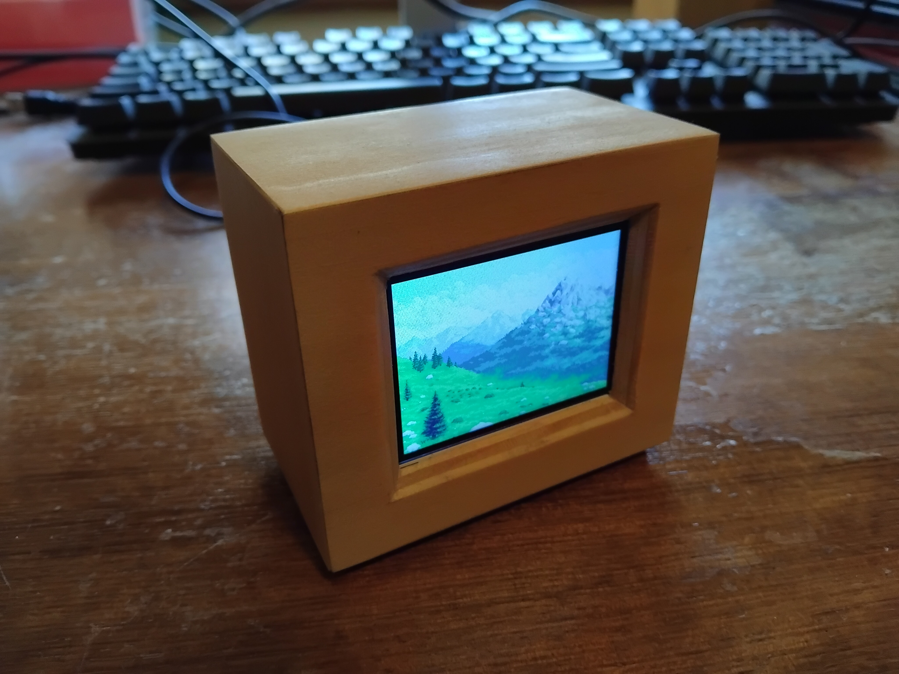
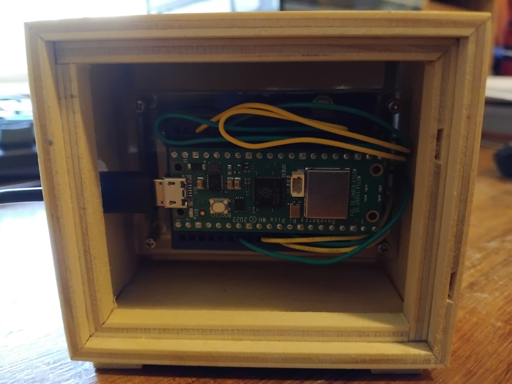
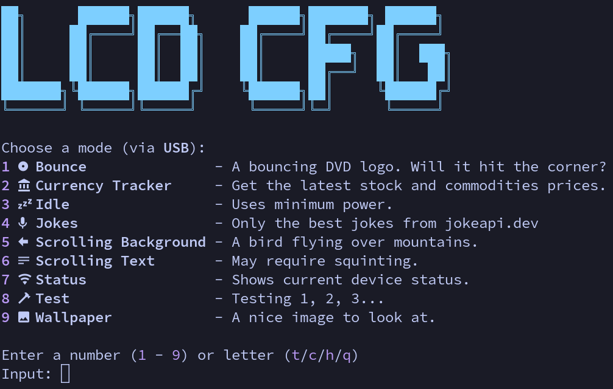

# LCD Box Project

## Overview

A "screen box" that can be set to various modes using a TUI program. These modes provide an animated background, stock price tracker, jokes, bouncing DVD logo and more.

Commands sent to the box can be sent via USB cable or WiFi.

Made using a [Raspberry Pi Pico W](https://datasheets.raspberrypi.com/picow/pico-w-product-brief.pdf) and a [2.4" LCD Display Module](https://www.waveshare.com/2.4inch-lcd-module.htm).

---

## Images

---

## Tooling

The [MicroPython ILI9341Display Driver](https://github.com/rdagger/micropython-ili9341) was used to send commands to the LCD module.

[rshell](https://github.com/dhylands/rshell) was used to interact with Pico unit as a Pyboard.
